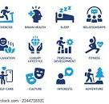

# 📊 Habit Tracker Dashboard

A fully responsive and interactive Habit Tracker Dashboard built with **React.js**. It helps users build consistency by tracking daily habits, showing visual progress with charts, and storing data locally in the browser.

---

## 🚀 Features

- ✅ Add and delete custom habits
- 📅 Track habit completion on a daily basis
- 📊 Visual performance chart showing completion percentage
- 🧭 Sidebar with user details (Name & Age)
- 💾 All data is stored in browser **localStorage**
- 🔄 Real-time updates across components using lifted state

---

## 📸 Screenshots

> *(Optional)* Add your own screenshot here  
> Example:
> 

---

## 🛠️ Tech Stack

- **React.js** (Vite)
- **JavaScript (ES6+)**
- **Recharts** – for performance visualization
- **CSS** – for custom dashboard styling
- **localStorage** – for client-side data persistence

---

## 📂 Folder Structure

```bash
habit_dashboard/
├── public/
│   └── vite.svg
├── src/
│   ├── assets/
│   │   └── dashboard.jpg
│   ├── components/
│   │   ├── Dashboard.jsx
│   │   ├── HabitForm.jsx
│   │   ├── HabitTable.jsx
│   │   ├── PerformanceChart.jsx
│   │   └── Sidebar.jsx
│   ├── data/
│   │   └── sampleHabits.js
│   ├── styles/
│   │   ├── dashboard.css
│   │   └── sidebar.css
│   ├── App.jsx
│   ├── index.css
│   └── main.jsx
├── package.json
├── README.md
└── vite.config.js
```
Installation
# Clone the repo
git clone https://github.com/ABINANDHAN2002/Habit-Dashboard.git

# Navigate into the project folder
cd Habit-Dashboard

# Install dependencies
npm install

# Start the development server
npm run dev
